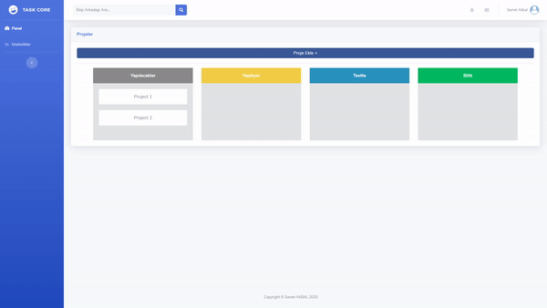
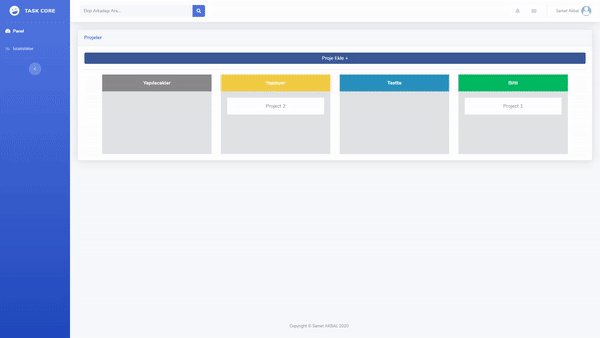
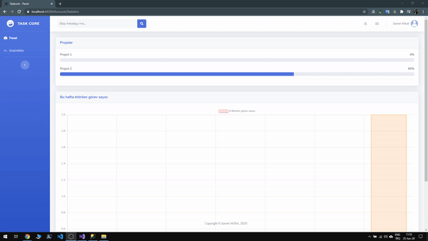
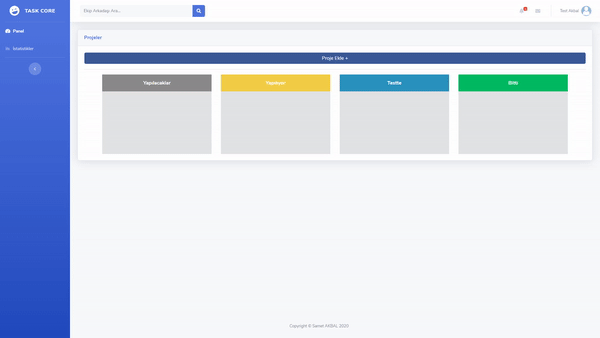

# Task Core Project Management System

- Task Core Kanban tekniğini esas alan bir proje yönetim sistemidir.
	

- Projeler Yapılacaklar, Yapılıyor, Testte ve Bitti olarak 4 ana başlık altında listelenir.

- Projeler alt görevlerden oluşur. Projeye tıklayıp altında onu oluşturan projeler aynı şekilde 4 ana başlık altında listelenir.

- Biten projelerin oranına göre ilerleme çubuğunda projenin durumu görüntülenebilir.

- İstatistikler sekmesinden projelerin durumları ve bulunan hafta içerisinde kaç görev bitirildiği görüntülenebilir.

- Sistemde kayıtlı kullanıcılara ekip arkadaşı isteği gönderebilir.

- Ekip arkadaşlarını projeye ekleyebilir ve eklenen arkadaşlar proje altındaki görevleri görüntüleyebilir ve yönetebilir.

