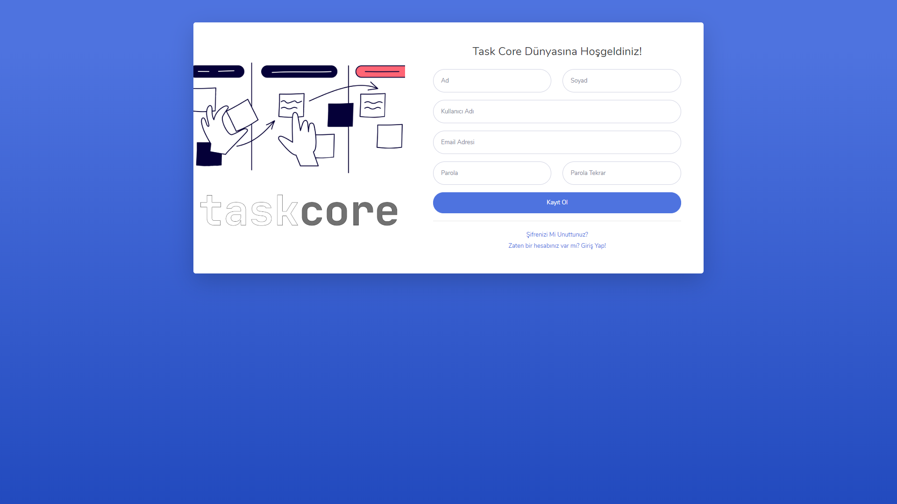
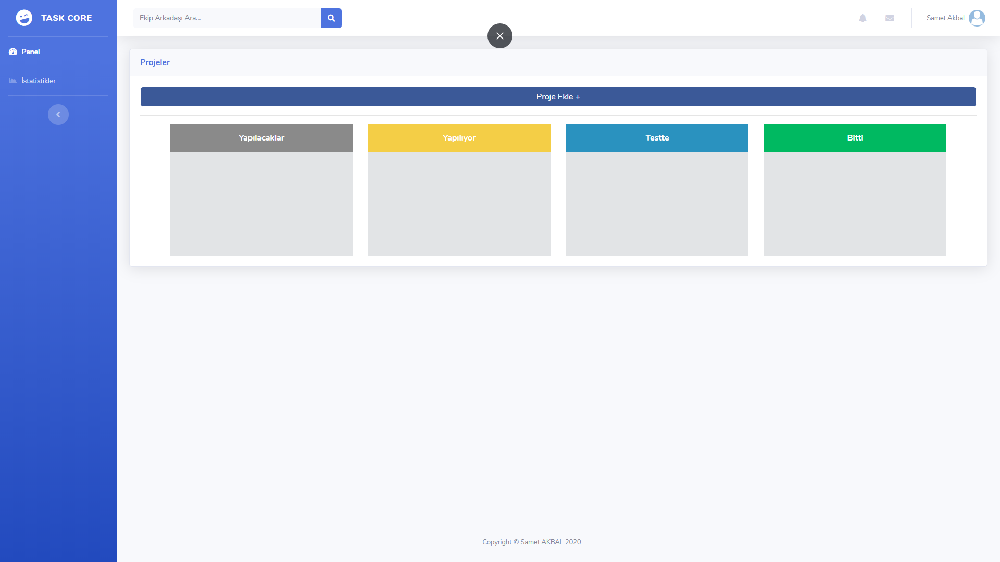

# Task Core Project Management System

- Task Core Kanban tekniğini esas alan bir proje yönetim sistemidir.
	

- Projeler Yapılacaklar, Yapılıyor, Testte ve Bitti olarak 4 ana başlık altında listelenir.

